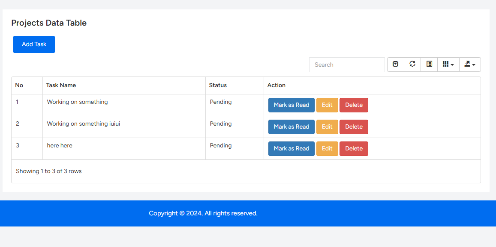

## To-Do Application
### The objective is to create a simple to-do application with a single screen using the technology stack of laravel livewire.

## Table of Contents
- ### Installation
- ### Usage
- ### Functionality
- ### User Interface

## Installation

### Instructions on how to set up the project on local machine.

## Clone the repository
### Git clone https://github.com/amanidavid/example-crud.git

## Navigate to the project directory
### cd yourproject

## Install dependencies
* ### composer install
* ###  composer update
* ###  npm install
* ###  npm run dev

## Migrate the databse
### php artisan migrate

## Serve the Application
### php artisan serve

## Usage
# Access the application in the browser
http://localhost:8000

## User Requirements.
- ### User shall be able to add new tasks on one screen.

- ### User shall be able to mark tasks as completed

- ### User shall be able to delete tasks.
- ### User shall be able to edit tasks.

## System Requirements
- ### The system shall dispaly all tasks one screen.
- ### Tasks that are completed shall be moved to the buttom of the list.

## User Interface

